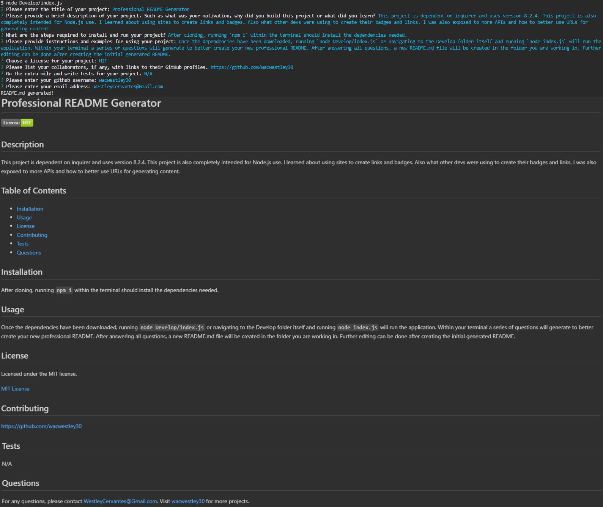

# Professional README Generator

## Description

This project is dependent on inquirer and uses version 8.2.4. This project is also completely intended for Node.js use. I learned about using sites to create links and badges. Also what other devs were using to create their badges and links. I was also exposed to more APIs and how to better use URLs for generating content.

## Table of Contents

- [Installation](#installation)
- [Usage](#usage)
- [License](#license)
- [Contributing](#contributing)
- [Tests](#tests)
- [Questions](#questions)

## Installation

After cloning, running `npm i` within the terminal should install the dependencies needed.

## Usage

Once the dependencies have been downloaded, running `node Develop/index.js` or navigating to the Develop folder itself and running `node index.js` will run the application. Within your terminal a series of questions will generate to better create your new professional README. After answering all questions, a new README.md file will be created in the folder you are working in. Further editing can be done after creating the initial generated README.

## License

Licensed under the MIT license.

[MIT License](https://opensource.org/licenses/MIT)

## Contributing

https://github.com/wacwestley30

## Tests

N/A

## Questions

For any questions, please contact WestleyCervantes@Gmail.com. Visit [wacwestley30](https://github.com/wacwestley30) for more projects.
